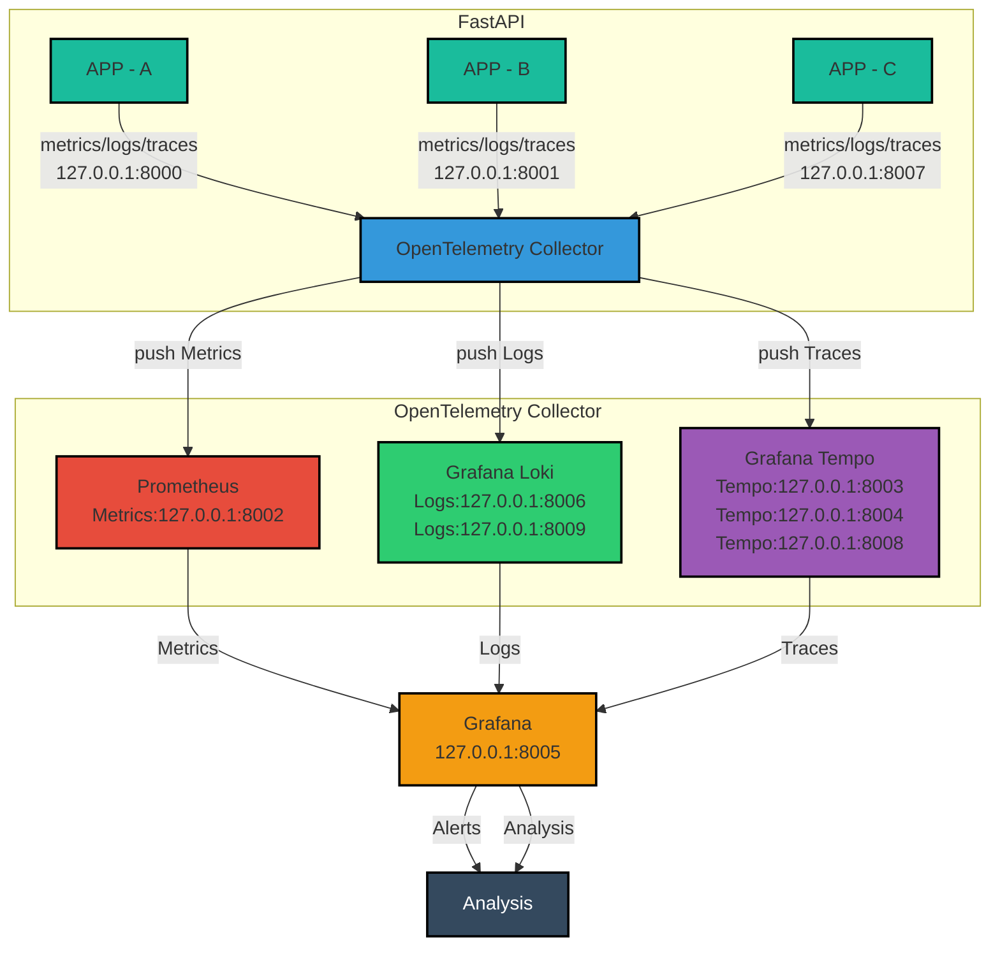

## 🚀 Recursos Principais



- **Loki:** Análise de Logs.
- **Tempo:** Análise de Traces.
- **Prometheus:** Análise de Métricas.
- **Grafana:** Dashboard para visualização.
- **API:** Armazena requisições ao ser acessada.
- **Docker:** Gerencia toda a aplicação na rede das plataformas.

## 🛠 Tecnologias Utilizadas
- Python
- FastAPI
- OpenTelemetry
- Grafana
- Prometheus
- Loki
- Tempo

## 🔧 Configuração do Ambiente

### 1. Clone o Repositório

```bash
git clone https://github.com/Vincenzo140/FastApi.git
```

### 2. Instalação e Configuração

#### Usando Docker:

1. Inicie o Docker manualmente:
   ```bash
   cd package_obs
   docker-compose up -d
   docker-compose up
   ```

### 3. Executando Testes de Carga com Locust

1. Instale o **Locust**:
   ```bash
   pip install locust
   ```

2. Rode o Locust:
   ```bash
   locust -f locustfile.py --headless --users 100 --spawn-rate 10 -H http://localhost:8000
   ```

### 4. Acessando as Ferramentas de Monitoramento

- **Grafana:** [http://localhost:8005](http://localhost:8005)
- **Prometheus:** [http://localhost:8002](http://localhost:8002)
- Outras portas dependentes podem ser verificadas nos containers Docker.